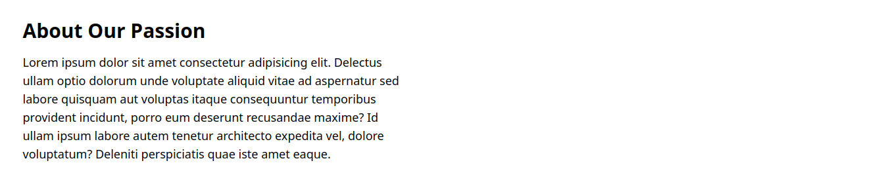

+++
title = "Tentang kami"
description = "Panduan langkah demi langkah tentang cara membuat bagian Tentang kami di Lontar Builder"
date = 2023-12-05T18:00:00+00:00
updated = 2023-12-05T18:00:00+00:00
draft = false
weight = 10
sort_by = "berat"
template = "docs/page.html"

[extra]
lead = 'Pelajari cara membuat bagian Tentang kami di Lontar Builder dengan berbagai macam template yang bisa di gunakan'
toc = true
top = false
+++

## Macam-macam bagian Tentang kami di Lontar Builder
Sebelumnya perlu anda ketahui bahwa di Lontar Builder untuk bagian Tentang kami ada beberapa template, tetapi untuk content nya tetap sama yaitu ada **gambar**, **judul**, dan **deskripsi**. Berikut ini beberapa macam template Tentang kami yang ada di Lontar Builder:

### ABOUT_1


Gambar di atas adalah contoh template Tentang kami 1, untuk membuat itu dapat menggunakan perintah dibawah ini:
```markdown
Title: ABOUT_1
about(1)_section_content:
about(1)_section_image(1) - "https://i.pinimg.com/564x/2f/7b/26/2f7b260ee9fbd2165f71e3eed93ab1d1.jpg"
about(1)_section_title(1) - "ABOUT US"
about(1)_section_text(1) - "PT. Examle Indonesia"
about(1)_section_text(2) - "Lorem ipsum dolor sit amet consectetur adipisicing elit. Voluptates deleniti quod tempora eveniet accusantium unde laboriosam, error omnis atque labore fugit dolorum rem velit aut minima, aperiam magni officiis beatae eum hic aliquid eaque. Consectetur molestiae ipsa officiis saepe, ad molestias ipsum quos corporis, incidunt minus sapiente id. Magnam impedit quis suscipit recusandae dolore exercitationem quas perspiciatis, fugit repellendus provident."
-END
```
Penjelasan Tipe Format di atas:

1. **Title: ABOUT_1**: Ini merupakan format untuk membuat bagian Tentang kami menggunakan template 1
2. **title_section_content**: Menunjukkan awal dari konten bagian.
3. **about(1)_section_image(1)**: Ini digunakan untuk memasukan url gambar di bagian Tentang kami. Jika anda mempunyai gambar yang tersimpan di lokal komputer, anda dapat menggunakan layanan berbagi gambar seperti [imgur](https://imgur.com/), [imgbb](https://id.imgbb.com/), dan yang lainnya.
4. **about(1)_section_title(1)**: Ini digunakan untuk memasukan nama judulnya, apakah akan dikasih nama Tentang kami atau yang lainnya pada bagian ini.
5. **about(1)_section_text(1)**: Ini digunakan untuk memasukan nama perusahaan atau yang lainnya.
6. **about(1)_section_text(2)**: Ini digunakan untuk memasukan deskrisi lebih rinci bagian Tentang kami
7. **-END**: Menandai akhir dari bagian Tentang kami, ini wajib dimasukan di setiap bagian manapun lalu jangan lupa di kasih enter setelahnya.

### ABOUT_2


Gambar di atas adalah contoh template Tentang kami 2, untuk membuat itu dapat menggunakan perintah dibawah ini:
```markdown
Title: ABOUT_2
about(2)_section_content:
about(2)_section_image(1) - "https://i.pinimg.com/564x/2f/7b/26/2f7b260ee9fbd2165f71e3eed93ab1d1.jpg"
about(2)_section_title(1) - "ABOUT US"
about(2)_section_text(1) - "Lorem ipsum, dolor sit amet consectetur adipisicing elit. Aspernatur impedit ut quasi alias saepe, quia tempora enim nulla eveniet dolores accusantium non nisi maxime amet quisquam laborum doloremque voluptate? Corrupti rerum aliquam commodi minima debitis earum, culpa fuga, recusandae expedita perspiciatis accusamus, sapiente inventore excepturi pariatur quis architecto fugit voluptatum illum. Eum eius ipsa, fugit non tenetur tempora id sint ad omnis dignissimos quis nam nemo. Eaque nobis animi quidem veritatis dignissimos, facilis sapiente sit corrupti qui. Ad sapiente tenetur corrupti incidunt perspiciatis dicta eius ab est magni ut praesentium provident, repellat maiores perferendis accusantium placeat ducimus tempore, maxime natus!"
-END
```
Penjelasan Tipe Format di atas:

1. **Title: ABOUT_2**: Ini merupakan format untuk membuat bagian Tentang kami menggunakan template 2
2. **title_section_content**: Menunjukkan awal dari konten bagian.
3. **about(2)_section_image(1)**: Ini digunakan untuk memasukan url gambar di bagian Tentang kami. Jika anda mempunyai gambar yang tersimpan di lokal komputer, anda dapat menggunakan layanan berbagi gambar seperti [imgur](https://imgur.com/), [imgbb](https://id.imgbb.com/), dan yang lainnya.
4. **about(2)_section_title(1)**: Ini digunakan untuk memasukan nama judulnya, apakah akan dikasih nama Tentang kami atau yang lainnya pada bagian ini.
5. **about(2)_section_text(1)**: Ini digunakan untuk memasukan deskrisi lebih rinci bagian Tentang kami.
6. **-END**: Menandai akhir dari bagian Tentang kami, ini wajib dimasukan di setiap bagian manapun lalu jangan lupa di kasih enter setelahnya.

### ABOUT_3


Gambar di atas adalah contoh template Tentang kami 3, untuk membuat itu dapat menggunakan perintah dibawah ini:
```markdown
Title: ABOUT_3
about(3)_section_content:
about(3)_section_image(1) - "https://example.com/image1.png"
about(3)_section_title(1) - "ABOUT US"
about(3)_section_text(1) - "PT. Examle Indonesia"
about(3)_section_text(2) - "Lorem, ipsum dolor sit amet consectetur adipisicing elit. Sunt exercitationem magnam eum accusantium est molestias minima voluptatem in quia aliquam veniam doloribus odio, delectus perspiciatis non itaque esse fugit nemo molestiae sit, veritatis quisquam laboriosam velit! Qui, est aliquam quam voluptatibus nesciunt ab voluptatem doloremque, quos consequuntur quae quo ad dicta repudiandae libero repellendus dolor atque at alias minus nihil voluptates iste? Quod, fugit, aperiam ipsum mollitia, illo modi doloribus id molestiae officia iure corporis."
-END
```
Penjelasan Tipe Format di atas:

1. **Title: ABOUT_3**: Ini merupakan format untuk membuat bagian Tentang kami menggunakan template 3
2. **title_section_content**: Menunjukkan awal dari konten bagian.
3. **about(3)_section_image(1)**: Ini digunakan untuk memasukan url gambar di bagian Tentang kami. Jika anda mempunyai gambar yang tersimpan di lokal komputer, anda dapat menggunakan layanan berbagi gambar seperti [imgur](https://imgur.com/), [imgbb](https://id.imgbb.com/), dan yang lainnya.
4. **about(3)_section_title(1)**: Ini digunakan untuk memasukan nama judulnya, apakah akan dikasih nama Tentang kami atau yang lainnya pada bagian ini.
5. **about(3)_section_text(1)**: Ini digunakan untuk memasukan nama perusahaan atau yang lainnya.
6. **about(3)_section_text(2)**: Ini digunakan untuk memasukan deskrisi lebih rinci bagian Tentang kami.
7. **-END**: Menandai akhir dari bagian Tentang kami, ini wajib dimasukan di setiap bagian manapun lalu jangan lupa di kasih enter setelahnya.

### ABOUT_4



Gambar di atas adalah contoh template Tentang kami 4, untuk membuat itu dapat menggunakan perintah dibawah ini:
```markdown
Title: ABOUT_4
about(4)_section_content:
about(4)_section_title(1) - "About Our Passion"
about(4)_section_text(1) - "Lorem ipsum dolor sit amet consectetur adipisicing elit. Delectus ullam optio dolorum unde voluptate aliquid vitae ad aspernatur sed labore quisquam aut voluptas itaque consequuntur temporibus provident incidunt, porro eum deserunt recusandae maxime? Id ullam ipsum labore autem tenetur architecto expedita vel, dolore voluptatum? Deleniti perspiciatis quae iste amet eaque."
-END
```
Penjelasan Tipe Format di atas:

1. **Title: ABOUT_4**: Ini merupakan format untuk membuat bagian Tentang kami menggunakan template 4
2. **title_section_content**: Menunjukkan awal dari konten bagian.
3. **about(4)_section_title(1)**: Ini digunakan untuk memasukan nama judulnya, apakah akan dikasih nama Tentang kami atau yang lainnya pada bagian ini.
4. **about(4)_section_text(1)**: Ini digunakan untuk memasukan deskrisi lebih rinci bagian Tentang kami.
5. **-END**: Menandai akhir dari bagian Tentang kami, ini wajib dimasukan di setiap bagian manapun lalu jangan lupa di kasih enter setelahnya.
